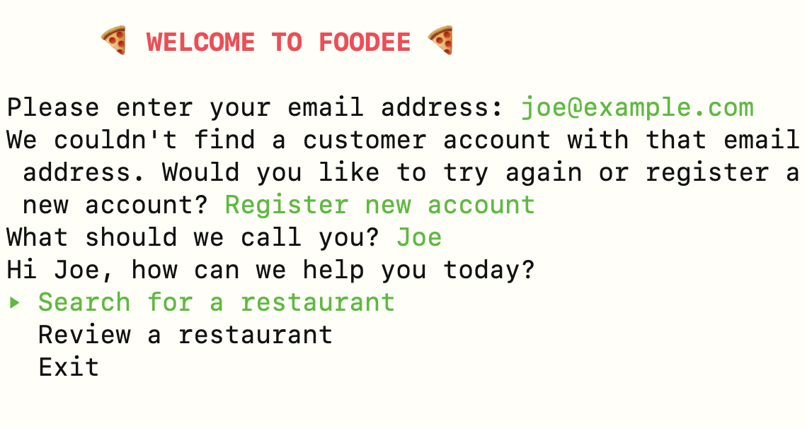

# FOODEE
## Usage
To install FOODEE, clone this repository with `git clone SOMETHING`, `cd` into it with `cd FOLDERNAME` and run `bundle` to install dependencies.

To seed the database, run `rake db:seed`. If you run into any errors here, you might need to try `bundle exec rake db:seed`.

FOODEE can then be run with `ruby bin/run.rb`.

## Features
### Customer
- Register an account in the database
- Search for restaurants, and get directions
- Review a restaurant from the database
- Delete and update your existing reviews

### Restaurant
- Log in as a restaurant from the database
- Read customer reviews of your restaurant
- Leave reviews for your customers

## Screenshots

